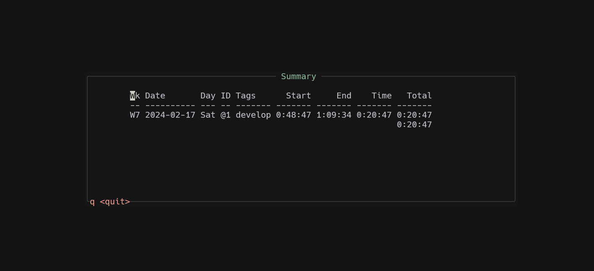

# timew.nvim
Run timew some timew commands from neovim

## Requirements

- [timewarrior](https://timewarrior.net/)
## Features

- run timew from neovim
- display your timew summary in a floating window
## Installation
Install timew.nvim with your preferred plugin manager, for example with [lazy.nvim](https://github.com/folke/lazy.nvim)
```lua
{
	"eliasCVII/timew.nvim",
	dependencies = {
		"MunifTanjim/nui.nvim",
	},
    opts = {
        -- your configuration lives here
        -- leave empty for defaults.
    }
}
```
## Configuration
At the moment, there are two settings that come by default with timew.nvim:

```lua
{
    -- these two settings follow the same format as they do in the timew command.
    -- they are shorthand for "timew summary :ids :{your setting}"
    summary_sort = "week", -- day, week, month or year. Display your summary based on a given timeframe.
    delete_sort = "week", -- day, week, month or year. I use summary to display a list of your tracked tasks
}

```
## Usage
### Commands
timew.nvim comes with the following commands:
- `Timew start`: start tracking a new task
- `Timew stop`: stop tracking the current task
- `Timew cancel` cancel tracking the current task
- `Timew continue`: resume tracking a previously tracked task
- `Timew delete`: delete a task from a list
- `Timew summary`: display a summary of your tracked tasks

### Keybindings
By default, timew.nvim doesnt come with any keybindings. Here is some example code to set keybindings.
```lua
-- Set Timew bindings
vim.keymap.set("n", "<leader>tn", "<Cmd>Timew start<CR>")
vim.keymap.set("n", "<leader>ts", "<Cmd>Timew stop<CR>")
vim.keymap.set("n", "<leader>tc", "<Cmd>Timew continue<CR>")
vim.keymap.set("n", "<leader>tC", "<Cmd>Timew cancel<CR>")
vim.keymap.set("n", "<leader>td", "<Cmd>Timew delete<CR>")
vim.keymap.set("n", "<leader>tS", "<Cmd>Timew summary<CR>")
```
